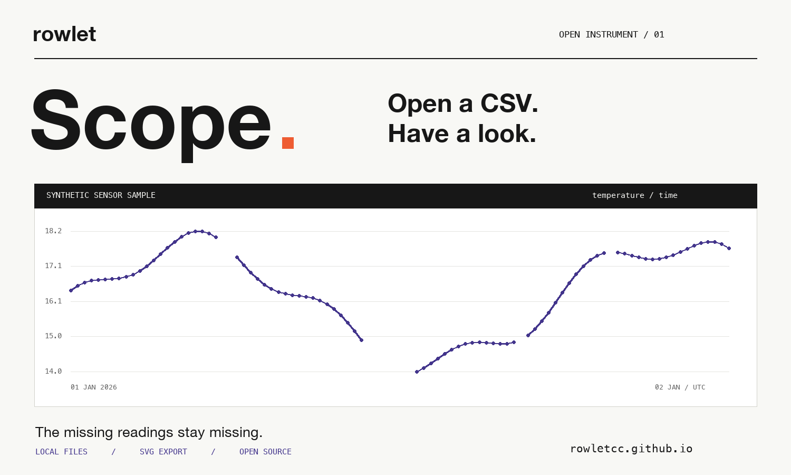

# Scope

**A browser instrument for observations, missing values and gaps.**

[Open Scope →](https://rowletcc.github.io/rowlet-scope/)



Drop in a CSV, choose two columns, and look at the data. Scope preserves file order and leaves interruptions visible. Open it with the built-in synthetic sensor sample to see how it works.

- Numeric and date/time horizontal axes; numeric vertical axis.
- Missing and invalid values, repeated coordinates, backwards steps and long sampling intervals remain unconnected.
- Inspect issues by logical CSV record number.
- Export an SVG plot and a JSON inspection report.
- Files are processed in your browser. No account, backend, telemetry, external fonts or runtime dependencies.

## Use it

1. Open a UTF-8 CSV or TSV, up to 5 MB and 50,000 data records.
2. Select comma, semicolon or tab as the separator. The first nonempty record supplies column names.
3. Choose the horizontal and vertical columns, then numeric or date/time parsing.
4. Adjust the gap threshold to suit the observations. Export the plot or report when ready.

Dates accept `YYYY-MM-DD` or ISO date-times with an explicit timezone. Dates and axis labels use UTC. Numeric values accept finite decimals and exponents. Empty numeric fields remain missing, including records such as `,` and `"",""`. Quoted separators, doubled quotes, multiline fields, BOM and CRLF are supported. Malformed quoting is rejected; inconsistent column counts are flagged.

The sample is synthetic. It contains missing readings, an invalid value and an interruption in sampling; it is not a field dataset or an instrument calibration.

## What a line means here

Connecting two observations asserts continuity across the interval. Scope breaks the line at missing or invalid values, invalid horizontal coordinates, repeated coordinates, backwards steps, or intervals greater than the selected multiple of the median positive adjacent interval.

That threshold is a display heuristic. It is not a test of scientific validity. Scope does not sort records, impute values, smooth curves, infer units, estimate uncertainty, validate sensor calibration or make inferential claims. Inspecting the file is still necessary.

For more than 1,200 valid observations, some point markers are omitted to keep the display usable. The curve still uses every valid point. The UI shows the first 200 issues; the report includes the full issue list. Record numbers identify logical CSV records, including the header, rather than physical text lines.

## Run locally

Serve this folder with any static HTTP server. For example, with Python installed:

```sh
python3 -m http.server 8000
```

Then open `http://localhost:8000`. No build or package installation is required. Once loaded, file processing and exports run locally in the page. The hosted site serves its assets from GitHub Pages; its standard hosting request logs are separate from file processing.

## Check the implementation

With Node.js 18 or later:

```sh
node --test test/core.test.mjs
```

See [VALIDATION.md](VALIDATION.md) for the release checks and their limits. Parsing and analysis are in [core.mjs](core.mjs); rendering and interaction are in [app.mjs](app.mjs).

## Bring a dataset workflow

[Describe a tool you need](https://github.com/RowletCC/rowlet-scope/issues/new?template=workflow.yml). A small, non-sensitive example and the output you need are enough to start. Please do not post private datasets. For private project enquiries: [chengjacky073@gmail.com](mailto:chengjacky073@gmail.com).

Built under **rowlet** — computing notes and open instruments. [Follow the work](https://x.com/RowletCC).

MIT licensed.
